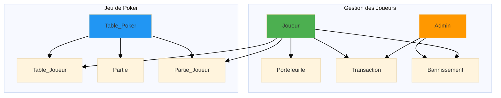

```mermaid
%%{init: {'theme':'base', 'themeVariables': { 'fontSize':'11px'}, 'er': {'layoutDirection': 'TB', 'minEntityWidth': 100, 'minEntityHeight': 75}}}%%
erDiagram
    %% ===== ENTITÉS PRINCIPALES =====

    JOUEUR {
        int id_joueur PK "Auto-increment"
        varchar(50) pseudo UK "Unique"
        varchar(255) mdp "Hash du mot de passe"
        varchar(255) mail
        int age
        decimal(10_2) credit "Crédit actuel"
        timestamp date_creation "Date d'inscription"
    }

    PORTEFEUILLE {
        int id_portefeuille PK
        int id_joueur FK,UK "Unique - Relation 1-1"
        decimal(10_2) solde "Solde du portefeuille"
    }

    TABLE_POKER {
        int id_table PK "Auto-increment"
        int nb_sieges "Nombre de places"
        decimal(10_2) blind_initial "Blind de départ"
        decimal(10_2) pot "Pot actuel"
        varchar(200) flop "Cartes du flop"
        varchar(200) turn "Carte du turn"
        varchar(200) river "Carte de la river"
        decimal(10_2) val_derniere_mise "Dernière mise"
        int nb_joueurs "Nombre de joueurs actuels"
        int id_joueur_tour "Joueur dont c'est le tour"
        int id_joueur_bouton "Joueur avec le bouton"
    }

    TABLE_JOUEUR {
        int id_table PK,FK
        int id_joueur PK,FK
        timestamp date_arrive "Date d'arrivée à la table"
    }

    PARTIE {
        int id_partie PK
        int id_table FK
        decimal(12_2) pot "Pot de la partie"
        timestamp date_debut "Début de la partie"
    }

    PARTIE_JOUEUR {
        int id_table PK,FK
        int id_joueur PK,FK
        int mise_tour "Mise du tour"
        decimal(10_2) solde_partie "Solde pour cette partie"
        varchar(50) statut "Statut: en_attente, actif, couché, gagnant"
        int id_siege "Numéro du siège"
        text cartes_main "Cartes en main"
    }

    ADMIN {
        int admin_id PK "Auto-increment"
        varchar(100) nom UK "Unique"
        varchar(255) mdp "Hash du mot de passe"
        varchar(255) mail UK "Unique"
        timestamp date_creation "Date de création"
    }

    TRANSACTION {
        int id_transaction PK "Serial"
        int id_joueur FK
        int solde "Montant de la transaction"
        timestamp date "Date de la transaction"
        varchar(50) statut "Statut: en_attente, validée, refusée"
        int id_admin FK "Admin validateur"
        timestamp date_validation "Date de validation"
    }

    JOUEUR_BANNIS {
        int id_ban PK "Auto-increment"
        int id_joueur FK
        int id_admin FK
        text raison_ban "Raison du bannissement"
        timestamp date_ban "Date du bannissement"
        timestamp date_fin_ban "Date de fin (NULL = permanent)"
        boolean actif "Bannissement actif"
    }

    %% ===== RELATIONS =====

    %% Joueur - Portefeuille (1-1)
    JOUEUR ||--|| PORTEFEUILLE : "possède"

    %% Joueur - Table_Joueur - Table_Poker (N-N)
    JOUEUR ||--o{ TABLE_JOUEUR : "s'assoit à"
    TABLE_POKER ||--o{ TABLE_JOUEUR : "accueille"

    %% Table_Poker - Partie (1-N)
    TABLE_POKER ||--o{ PARTIE : "héberge"

    %% Partie_Joueur (N-N entre Joueur et Table via partie)
    JOUEUR ||--o{ PARTIE_JOUEUR : "participe à"
    TABLE_POKER ||--o{ PARTIE_JOUEUR : "contient"

    %% Joueur - Transaction (1-N)
    JOUEUR ||--o{ TRANSACTION : "effectue"

    %% Admin - Transaction (1-N)
    ADMIN ||--o{ TRANSACTION : "valide"

    %% Admin - Joueur_Bannis (1-N)
    ADMIN ||--o{ JOUEUR_BANNIS : "bannit"

    %% Joueur - Joueur_Bannis (1-N)
    JOUEUR ||--o{ JOUEUR_BANNIS : "peut être banni"
```

```mermaid
%%{init: {'theme':'base', 'themeVariables': { 'fontSize':'11px'}, 'flowchart': {'nodeSpacing': 30, 'rankSpacing': 40}}}%%
graph TB
    subgraph "Gestion des Joueurs"
        J[Joueur] --> P[Portefeuille]
        J --> T[Transaction]
        A[Admin] --> T
        A --> B[Bannissement]
        J --> B
    end

    subgraph "Jeu de Poker"
        J --> TJ[Table_Joueur]
        TP[Table_Poker] --> TJ
        TP --> PA[Partie]
        J --> PJ[Partie_Joueur]
        TP --> PJ
    end

    style J fill:#4CAF50
    style A fill:#FF9800
    style TP fill:#2196F3
```