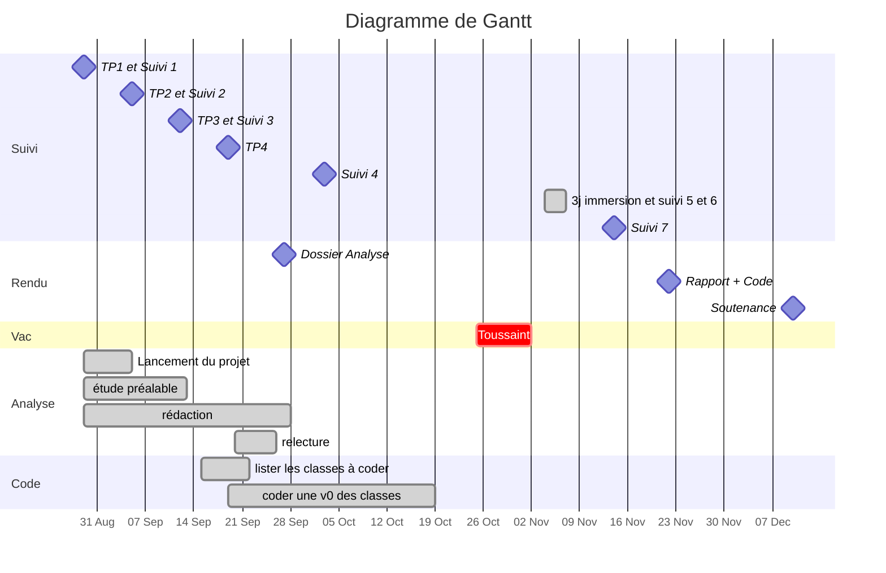

à utiliser avec **https://hackmd.io/**

# :clipboard:  Présentation du sujet

* **Sujet** : Application pour jouer en ligne au poker
* **Tuteur / Tutrice** : Lucas Bouju 
* [Dépôt GitHub](https://github.com/tomdtd/ENSAI-2A-projet-info-Albane-Tom-Neville-Floraline.git)

# :dart: Échéances

---
Dossier d'Analyse :  :clock1: <iframe src="https://free.timeanddate.com/countdown/i83zdl7u/n1264/cf11/cm0/cu2/ct4/cs0/ca0/co0/cr0/ss0/cac009/cpcf00/pcfff/tcfff/fs100/szw256/szh108/iso2025-10-07T12:00:00" allowtransparency="true" frameborder="0" width="130" height="16"></iframe>

---

# :calendar: Livrables

| ------- | ------------------------------------------------------------ |
| 27 sep. | [Dossier d'Analyse](https://www.overleaf.com/)               |
| 22 nov. | Rapport final + code |
| 10 déc. | Soutenance                                                    |

# :construction: Todo List

## Dossier Analyse

* [x] Diagramme de Gantt
* [x] Diagramme de cas d'utilisation
* [x] Diagramme C4
* [x] Diagramme de classe

## Code

* [x] Business Layer
* [x] Service Layer
* [x] DAO Layer
* [x] Web service
* [x] Controller Layer

---

* [x] appel WS
* [x] création WS

---

